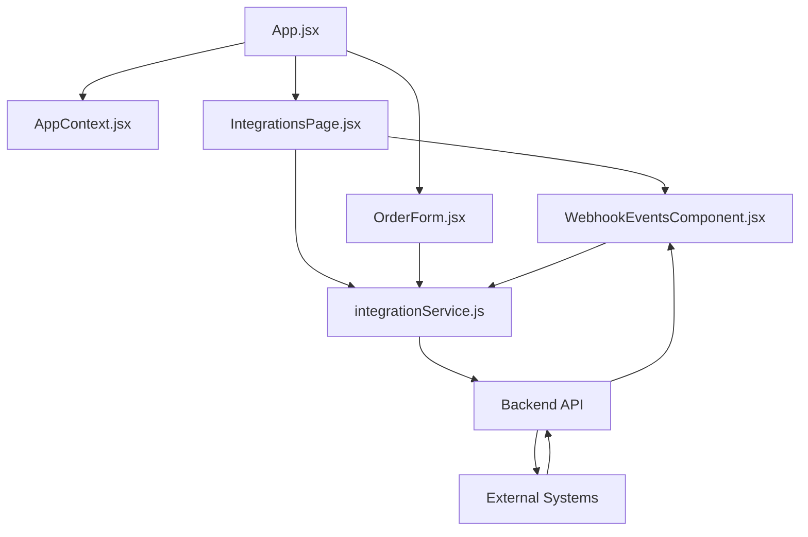

# Backend Integration Manager

A comprehensive dashboard for managing backend integrations with external services like Square POS, SendGrid, and Twilio. This application provides a unified interface for connecting to external systems, managing webhooks, and processing orders.

## Table of Contents

- [Overview](#overview)
- [Features](#features)
- [Architecture](#architecture)
- [Installation](#installation)
- [Development](#development)
- [Testing](#testing)
- [Deployment](#deployment)
- [Security](#security)
- [Performance Optimization](#performance-optimization)
- [Component Documentation](#component-documentation)

## Overview

The Backend Integration Manager is a React-based frontend application that interfaces with a Node.js/Express backend to provide seamless integration with various third-party services. It allows users to:

- Connect to external systems like Square POS, SendGrid, and Twilio
- Manage active connections and their status
- Register and monitor webhooks for event notifications
- Process orders through Square POS
- View real-time webhook events

## Features

- **Integration Management**: Connect to and disconnect from external systems
- **Webhook Management**: Register webhooks and view incoming webhook events
- **Order Processing**: Create and submit orders to Square POS
- **Real-time Updates**: Automatic polling for webhook events
- **Responsive Design**: Works on desktop and mobile devices
- **JWT Authentication**: Secure API access with JSON Web Tokens

## Architecture

The application follows a modular architecture with clear separation of concerns:



### Key Components

- **App.jsx**: Main application component with routing
- **AppContext.jsx**: Global state management
- **IntegrationsPage.jsx**: Page for managing integrations and webhooks
- **OrderForm.jsx**: Form for creating and submitting orders
- **WebhookEventsComponent.jsx**: Component for displaying webhook events
- **integrationService.js**: Service for communicating with the backend API

## Installation

### Prerequisites

- Node.js 16.x or higher
- npm 8.x or higher

### Setup

1. Clone the repository:
   ```bash
   git clone https://github.com/your-org/backend-integration-manager.git
   cd backend-integration-manager
   ```

2. Install dependencies:
   ```bash
   npm install
   ```

3. Create a `.env` file with the following variables:
   ```
   VITE_API_URL=http://localhost:3000
   ```

4. Start the development server:
   ```bash
   npm run dev
   ```

## Development

### Project Structure

```
backend-integration-manager/
├── public/                  # Static assets
├── src/
│   ├── api/                 # API utilities
│   ├── assets/              # Images, fonts, etc.
│   ├── components/          # Reusable components
│   │   ├── OrderForm.jsx    # Order form component
│   │   └── WebhookEventsComponent.jsx # Webhook events component
│   ├── contexts/            # React contexts
│   │   └── AppContext.jsx   # Global application context
│   ├── pages/               # Page components
│   │   └── IntegrationsPage.jsx # Integrations management page
│   ├── services/            # Service modules
│   │   └── integrationService.js # Backend integration service
│   ├── tests/               # Test files
│   ├── App.jsx              # Main application component
│   ├── App.css              # Main application styles
│   ├── index.css            # Global styles
│   └── main.jsx             # Application entry point
├── .env                     # Environment variables
├── .eslintrc.js             # ESLint configuration
├── package.json             # Project dependencies and scripts
├── vite.config.js           # Vite configuration
└── README.md                # Project documentation
```

### Code Style

This project follows the Airbnb JavaScript Style Guide with some modifications. ESLint and Prettier are configured to enforce consistent code style.

To lint the code:
```bash
npm run lint
```

To automatically fix linting issues:
```bash
npm run lint:fix
```

## Testing

The project uses Jest and React Testing Library for testing components and services.

### Running Tests

```bash
# Run all tests
npm test

# Run tests with coverage
npm run test:coverage

# Run tests in watch mode
npm run test:watch
```

### Example Tests

#### Testing a Component

```jsx
// src/tests/components/OrderForm.test.jsx
import { render, screen, fireEvent, waitFor } from '@testing-library/react';
import OrderForm from '../../components/OrderForm';
import integrationService from '../../services/integrationService';

// Mock the integration service
jest.mock('../../services/integrationService');

describe('OrderForm', () => {
  beforeEach(() => {
    // Reset mocks before each test
    jest.clearAllMocks();
  });

  test('renders the form correctly', () => {
    render(<OrderForm />);
    
    // Check if important elements are rendered
    expect(screen.getByText('Create New Order')).toBeInTheDocument();
    expect(screen.getByLabelText('Name:')).toBeInTheDocument();
    expect(screen.getByText('Add Item')).toBeInTheDocument();
  });

  test('validates form before submission', () => {
    render(<OrderForm />);
    
    // Try to submit without required fields
    fireEvent.click(screen.getByText('Submit Order'));
    
    // Check for validation error
    expect(screen.getByText('Customer name is required')).toBeInTheDocument();
  });

  test('submits form successfully', async () => {
    // Mock successful response
    integrationService.send.mockResolvedValue({
      orderId: '123456',
      status: 'confirmed',
      receiptUrl: 'https://example.com/receipt/123456'
    });
    
    render(<OrderForm />);
    
    // Fill out the form
    fireEvent.change(screen.getByLabelText('Name:'), {
      target: { value: 'John Doe' }
    });
    
    fireEvent.change(screen.getByLabelText('Item:'), {
      target: { value: 'Pizza' }
    });
    
    fireEvent.change(screen.getByLabelText('Qty:'), {
      target: { value: '2' }
    });
    
    fireEvent.change(screen.getByLabelText('Price:'), {
      target: { value: '12.99' }
    });
    
    // Submit the form
    fireEvent.click(screen.getByText('Submit Order'));
    
    // Wait for success message
    await waitFor(() => {
      expect(screen.getByText('Order Successfully Processed!')).toBeInTheDocument();
    });
    
    // Check if service was called with correct data
    expect(integrationService.send).toHaveBeenCalledWith(
      'square',
      'orders/create',
      expect.objectContaining({
        customerName: 'John Doe',
        items: expect.arrayContaining([
          expect.objectContaining({
            name: 'Pizza',
            quantity: 2,
            price: 12.99
          })
        ])
      })
    );
  });
});
```

#### Testing a Service

```jsx
// src/tests/services/integrationService.test.js
import axios from 'axios';
import integrationService from '../../services/integrationService';

// Mock axios
jest.mock('axios');

describe('integrationService', () => {
  beforeEach(() => {
    jest.clearAllMocks();
  });

  test('getAdapters fetches adapters correctly', async () => {
    // Mock response data
    const mockAdapters = [
      { id: 'square', name: 'Square POS' },
      { id: 'sendgrid', name: 'SendGrid' }
    ];
    
    // Setup mock response
    axios.get.mockResolvedValue({ data: mockAdapters });
    
    // Call the service method
    const result = await integrationService.getAdapters();
    
    // Check if axios was called correctly
    expect(axios.get).toHaveBeenCalledWith('/api/integration/adapters');
    
    // Check if the result matches the mock data
    expect(result).toEqual(mockAdapters);
  });

  test('connect sends credentials correctly', async () => {
    // Mock response data
    const mockConnection = { id: 'conn_123', status: 'active' };
    
    // Setup mock response
    axios.post.mockResolvedValue({ data: mockConnection });
    
    // Mock credentials
    const credentials = { apiKey: 'test_key', locationId: 'loc_123' };
    
    // Call the service method
    const result = await integrationService.connect('square', credentials);
    
    // Check if axios was called correctly
    expect(axios.post).toHaveBeenCalledWith(
      '/api/integration/connect/square',
      credentials
    );
    
    // Check if the result matches the mock data
    expect(result).toEqual(mockConnection);
  });

  test('handles errors correctly', async () => {
    // Setup mock error
    const mockError = new Error('Network error');
    axios.get.mockRejectedValue(mockError);
    
    // Call the service method and expect it to throw
    await expect(integrationService.getAdapters()).rejects.toThrow('Network error');
    
    // Check if error was logged
    expect(console.error).toHaveBeenCalledWith(
      'Error fetching adapters:',
      mockError
    );
  });
});
```

## Deployment

### Frontend Deployment (Vercel)

The frontend application is configured for deployment on Vercel.

1. Create a `vercel.json` file in the project root:
   ```json
   {
     "version": 2,
     "builds": [
       {
         "src": "package.json",
         "use": "@vercel/static-build",
         "config": { "distDir": "dist" }
       }
     ],
     "routes": [
       { "handle": "filesystem" },
       { "src": "/.*", "dest": "/index.html" }
     ],
     "env": {
       "VITE_API_URL": "@vite_api_url"
     }
   }
   ```

2. Set up environment variables in Vercel:
   - `VITE_API_URL`: URL of the backend API

3. Deploy to Vercel:
   ```bash
   vercel
   ```

### Backend Deployment (AWS Docker)

The backend is deployed as a Docker container on AWS ECS.

1. Create a `Dockerfile` in the backend project:
   ```dockerfile
   FROM node:16-alpine

   WORKDIR /app

   COPY package*.json ./
   RUN npm ci --only=production

   COPY . .

   EXPOSE 3000

   CMD ["node", "server.js"]
   ```

2. Build and push the Docker image:
   ```bash
   docker build -t backend-integration-api .
   docker tag backend-integration-api:latest <aws-account-id>.dkr.ecr.<region>.amazonaws.com/backend-integration-api:latest
   docker push <aws-account-id>.dkr.ecr.<region>.amazonaws.com/backend-integration-api:latest
   ```

3. Create an ECS task definition and service to run the container.

4. Configure environment variables in the task definition:
   - `JWT_SECRET`: Secret key for JWT authentication
   - `SQUARE_API_KEY`: Square API key
   - `SENDGRID_API_KEY`: SendGrid API key
   - `TWILIO_ACCOUNT_SID`: Twilio account SID
   - `TWILIO_AUTH_TOKEN`: Twilio auth token

## Security

### JWT Implementation Recommendations

The application uses JWT (JSON Web Tokens) for authentication. Here are some security recommendations:

1. **Token Storage**:
   - Currently, tokens are stored in localStorage, which is vulnerable to XSS attacks.
   - Consider using HttpOnly cookies for token storage to mitigate XSS risks.

2. **Token Expiration**:
   - Set short expiration times (e.g., 15-60 minutes) for access tokens.
   - Implement refresh tokens with longer expiration for seamless re-authentication.

3. **Token Payload**:
   - Minimize sensitive data in token payload.
   - Include only necessary claims like user ID and roles.

4. **Token Validation**:
   - Validate tokens on every request.
   - Check expiration, signature, and issuer.

5. **HTTPS**:
   - Always use HTTPS in production to encrypt token transmission.

6. **CSRF Protection**:
   - Implement CSRF tokens for sensitive operations.

### Implementation Example

```javascript
// Backend JWT generation
const generateTokens = (user) => {
  const accessToken = jwt.sign(
    { id: user.id, role: user.role },
    process.env.JWT_SECRET,
    { expiresIn: '30m' }
  );
  
  const refreshToken = jwt.sign(
    { id: user.id },
    process.env.JWT_REFRESH_SECRET,
    { expiresIn: '7d' }
  );
  
  return { accessToken, refreshToken };
};

// Frontend token handling
const login = async (credentials) => {
  try {
    const response = await axios.post('/api/auth/login', credentials);
    const { accessToken, refreshToken } = response.data;
    
    // Store tokens securely
    document.cookie = `refreshToken=${refreshToken}; path=/; HttpOnly; Secure; SameSite=Strict; max-age=${7 * 24 * 60 * 60}`;
    sessionStorage.setItem('accessToken', accessToken);
    
    // Set authorization header for future requests
    axios.defaults.headers.common['Authorization'] = `Bearer ${accessToken}`;
    
    return true;
  } catch (error) {
    console.error('Login failed:', error);
    return false;
  }
};
```

## Performance Optimization

The application is optimized to handle moderate traffic (50-100 orders/hour, hundreds of webhook events daily). Here are the key optimizations:

### Frontend Optimizations

1. **Code Splitting**:
   - Use React.lazy and Suspense to load components on demand.
   - Split the bundle by route to reduce initial load time.

2. **Memoization**:
   - Use React.memo for components that render frequently.
   - Use useMemo and useCallback for expensive calculations and event handlers.

3. **Virtualization**:
   - Implement virtualized lists for webhook events to handle large datasets efficiently.

4. **Debouncing and Throttling**:
   - Debounce search inputs and form submissions.
   - Throttle webhook polling to reduce API load.

### Backend Optimizations

1. **Caching**:
   - Implement Redis caching for frequently accessed data.
   - Cache adapter configurations and connection status.

2. **Database Indexing**:
   - Create indexes for frequently queried fields.
   - Use compound indexes for common query patterns.

3. **Connection Pooling**:
   - Use connection pools for database and external API connections.

4. **Webhook Processing**:
   - Process webhooks asynchronously using a queue system.
   - Implement retry logic for failed webhook deliveries.

### Implementation Examples

#### Frontend Virtualization

```jsx
import { FixedSizeList } from 'react-window';

const WebhookEventsList = ({ events }) => {
  const renderEvent = ({ index, style }) => {
    const event = events[index];
    return (
      <div style={style} className="webhook-event-card">
        <div className="event-header">
          <span className="event-source">{event.source}</span>
          <span className="event-timestamp">{formatTimestamp(event.timestamp)}</span>
        </div>
        <div className="event-path">Path: {event.path}</div>
        <div className="event-method">Method: {event.method}</div>
      </div>
    );
  };

  return (
    <FixedSizeList
      height={500}
      width="100%"
      itemCount={events.length}
      itemSize={150}
    >
      {renderEvent}
    </FixedSizeList>
  );
};
```

#### Backend Caching

```javascript
const Redis = require('ioredis');
const redis = new Redis(process.env.REDIS_URL);

// Cache adapter list with 1-hour expiration
const getAdapters = async () => {
  try {
    // Try to get from cache first
    const cachedAdapters = await redis.get('adapters');
    if (cachedAdapters) {
      return JSON.parse(cachedAdapters);
    }
    
    // If not in cache, fetch from database
    const adapters = await Adapter.find().lean();
    
    // Store in cache for 1 hour
    await redis.set('adapters', JSON.stringify(adapters), 'EX', 3600);
    
    return adapters;
  } catch (error) {
    console.error('Error fetching adapters:', error);
    throw error;
  }
};
```

## Component Documentation

For detailed documentation on individual components, please refer to the following files:

- [Integration Service](./docs/components/IntegrationService.md)
- [Integrations Page](./docs/components/IntegrationsPage.md)
- [Webhook Events Component](./docs/components/WebhookEventsComponent.md)
- [Order Form](./docs/components/OrderForm.md)
- [App Context](./docs/components/AppContext.md)
